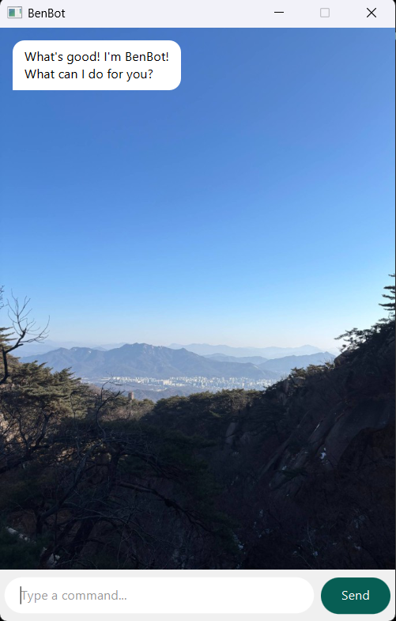

# BenBot User Guide

BenBot is a desktop task-management chatbot. You can talk to it via a **graphical interface** (GUI) or a **text-based console**. It keeps a list of tasks (todos, deadlines, and events), lets you mark them done, search them, and more. Tasks are saved automatically to your computer.



---

## Quick start

1. **Run the app (GUI):** Double-click `BenBot.jar` or run `.\gradlew.bat run` from the project folder. The BenBot window opens with a greeting.
2. **Run the app (console):** Run the `benbot.Launcher` class with console mode, or use the JAR with a console entry point if configured.
3. Type commands in the input box and press **Send** (or Enter). Type `help` to see all commands.

---

## Features

### Viewing all tasks: `list`

Shows every task in your list with its index, type, status, and details.

**Usage:** `list`

**Example:** `list`

**Example output:**

```
____________________________________________________________
 Here are the tasks in your list:
 1.[T][ ] read book
 2.[D][ ] return book (by: Feb 10 2025)
 3.[E][ ] meeting (from: Mon 2pm to: 3pm)
____________________________________________________________
```

---

### Adding a todo: `todo`

Adds a task with no date.

**Usage:** `todo <description>`

**Example:** `todo read book`

**Example output:**

```
____________________________________________________________
 Got it. I've added this task:
   [T][ ] read book
 Now you have 3 tasks in the list.
____________________________________________________________
```

---

### Adding a deadline: `deadline`

Adds a task with a due date. The date must be in **yyyy-mm-dd** format.

**Usage:** `deadline <description> /by <date>`

**Example:** `deadline return book /by 2025-02-10`

**Example output:**

```
____________________________________________________________
 Got it. I've added this task:
   [D][ ] return book (by: Feb 10 2025)
 Now you have 4 tasks in the list.
____________________________________________________________
```

---

### Adding an event: `event`

Adds an event with start and end times.

**Usage:** `event <description> /from <from> /to <to>`

**Example:** `event meeting /from Mon 2pm /to 3pm`

**Example output:**

```
____________________________________________________________
 Got it. I've added this task:
   [E][ ] meeting (from: Mon 2pm to: 3pm)
 Now you have 5 tasks in the list.
____________________________________________________________
```

---

### Marking a task as done: `mark`

Marks the task at the given list number as done.

**Usage:** `mark <number>`

**Example:** `mark 1`

**Example output:**

```
____________________________________________________________
 Nice! I've marked this task as done:
   [T][X] read book
____________________________________________________________
```

---

### Marking a task as not done: `unmark`

Marks the task at the given list number as not done.

**Usage:** `unmark <number>`

**Example:** `unmark 1`

**Example output:**

```
____________________________________________________________
 OK, I've marked this task as not done yet:
   [T][ ] read book
____________________________________________________________
```

---

### Deleting a task: `delete`

Removes the task at the given list number from the list.

**Usage:** `delete <number>`

**Example:** `delete 1`

**Example output:**

```
____________________________________________________________
 Noted. I've removed this task:
   [T][ ] read book
 Now you have 4 tasks in the list.
____________________________________________________________
```

---

### Finding tasks by keyword: `find`

Shows tasks whose description contains the given keyword (case-insensitive).

**Usage:** `find <keyword>`

**Example:** `find book`

**Example output:**

```
____________________________________________________________
 Here are the matching tasks in your list:
 1.[T][ ] read book
 2.[D][ ] return book (by: Feb 10 2025)
____________________________________________________________
```

---

### Exiting the application: `bye`

Saves your tasks and closes BenBot (in GUI mode the window closes).

**Usage:** `bye`

**Example:** `bye`

**Example output:**

```
____________________________________________________________
 Bye. Hope to see you again soon!
____________________________________________________________
```

---

### Viewing help: `help`

Shows a list of all commands with short descriptions and usage.

**Usage:** `help`

Type `help` in the chat to see the full help message in the app.

---

## Command summary

| Command | Description |
|--------|-------------|
| `list` | Show all tasks |
| `todo <description>` | Add a todo |
| `deadline <description> /by <date>` | Add a deadline (date: yyyy-mm-dd) |
| `event <description> /from <from> /to <to>` | Add an event |
| `mark <number>` | Mark task as done |
| `unmark <number>` | Mark task as not done |
| `delete <number>` | Remove a task |
| `find <keyword>` | Find tasks by keyword |
| `bye` | Exit BenBot |
| `help` | Show help |

---

## Saving data

BenBot stores your task list in a file (by default `./data/benbot.txt`). The file is updated automatically when you add, mark, unmark, or delete tasks. You do not need to save manually.
